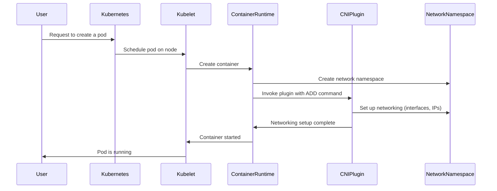

```mermaid
sequenceDiagram
    participant User
    participant Kubernetes
    participant Kubelet
    participant ContainerRuntime
    participant CNIPlugin
    participant NetworkNamespace

    User->>Kubernetes: Request to create a pod
    Kubernetes->>Kubelet: Schedule pod on node
    Kubelet->>ContainerRuntime: Create container
    ContainerRuntime->>NetworkNamespace: Create network namespace
    ContainerRuntime->>CNIPlugin: Invoke plugin with ADD command
    CNIPlugin->>NetworkNamespace: Set up networking (interfaces, IPs)
    CNIPlugin->>ContainerRuntime: Networking setup complete
    ContainerRuntime->>Kubelet: Container started
    Kubelet->>User: Pod is running
```